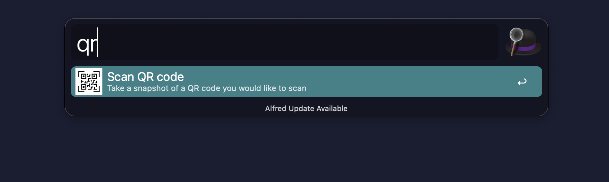

# alfred-qr
Alfred workflow for scanning and decoding QR codes by taking a snapshot, Built in Rust

<p align="center"><a href="https://github.com/omerdn1/alfred-qr/releases/"></a></p>

## Commands

* `qr`: promts you to take a screenshot of a QR Code. Once the QR has been decoded, a notification will show, and the result will be saved to the clipboard

## [Download .alfredworkflow](https://github.com/omerdn1/alfred-qr/releases/) 

### Rebuild binary and alfred workflow

```
./build-workflow.sh
open alfred-qr.alfredworkflow
```

